

  <h3>Login</h3>
  
Log into the application with your credentials. If you don't have an account, click <strong>Sign Up</strong> to create a new account. Once you have logged in, you will be directed to projects page

  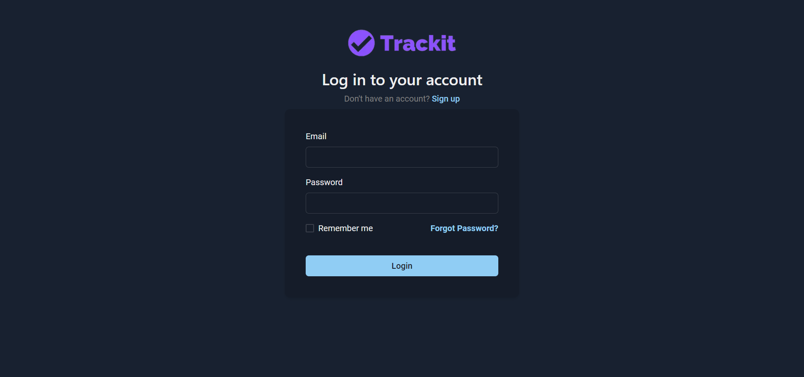

  <h3>View All Projects</h3>
  
You will find all the projects you have created or belong to. You can also search and sort the projects. Click on <b>Add Project</b> to create new project

  <em><b>If your permissions doesn't allow you to manage project, "Add Project" will not be displayed</b></em>
  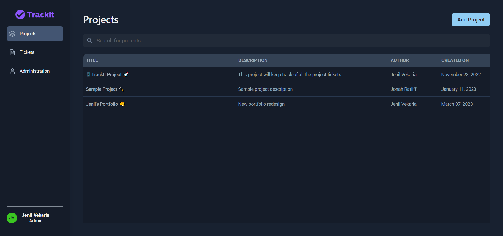

  <h3>Add Project</h3>
  
Enter your project information here (Title and description)

  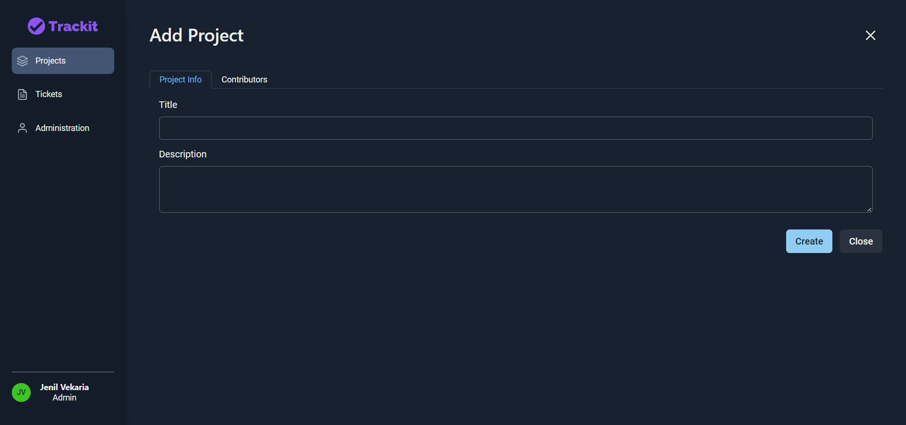

  <h3>Add Project (Contributor)</h3>
  
Select all the project contributors. You will also see what type of role the user belong to.

  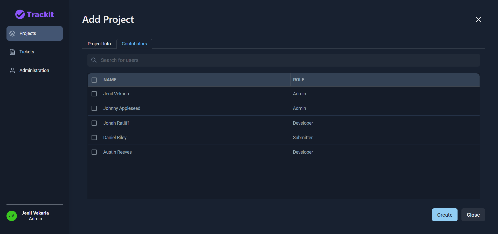

  <h3>View Project Info</h3>
  
Once you have created your project, you will see all your project tickets (intially none). You create new tickets, view project info and edit exisiting ticket.

   <em><b>If your permissions doesn't allow you to manage tickets, "Add Ticket" will not be displayed</b></em>
  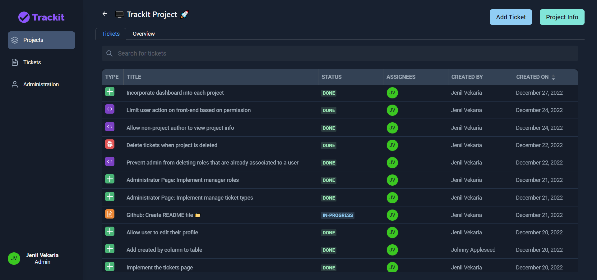

  <h3>Project Overview</h3>
  
Click on <b>Overview</b> to see the project statistics

  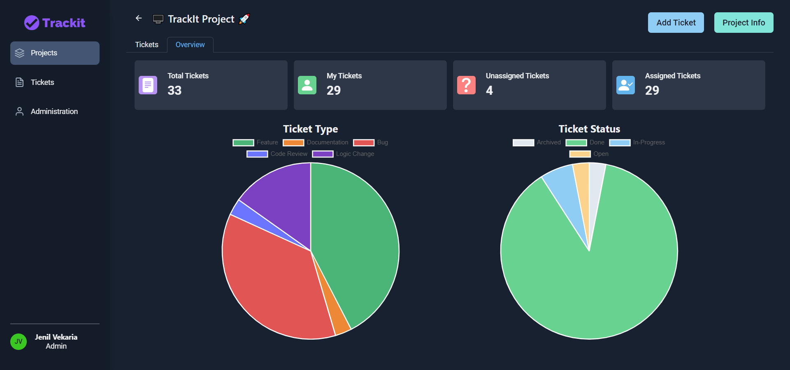

  <h3>View Ticket Info</h3>
  
Click on the existing ticket, you can edit the ticket info, add comment or update the ticket assignee

  <em><b>If your permission doesn't allow you to manage tickets, all the fields, comments, assigness will be disabled</b></em>
  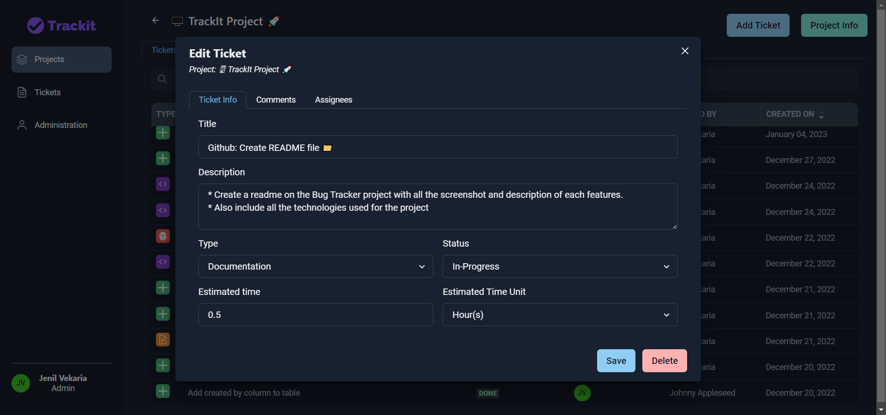

  <h3>View Ticket Comments</h3>
  
Click on comments tab, you will see all the ticket comments and you can also comment on it.

  <em><b>If your permission doesn't allow you to manage comments, you will not be able to comment</b></em>
  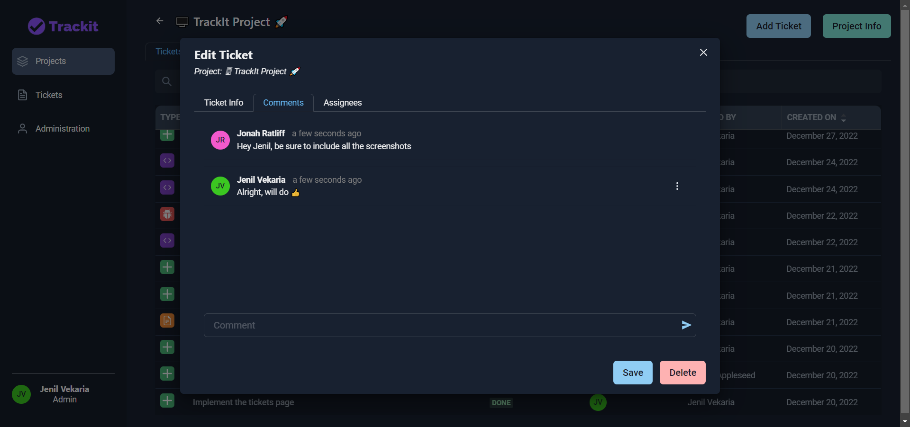

  <h3>My Tickets</h3>
  
Click on <b>Tickets</b> tab to see all your tickets regarless of what project it belongs to. Clicking on the ticket will allow you to edit it

  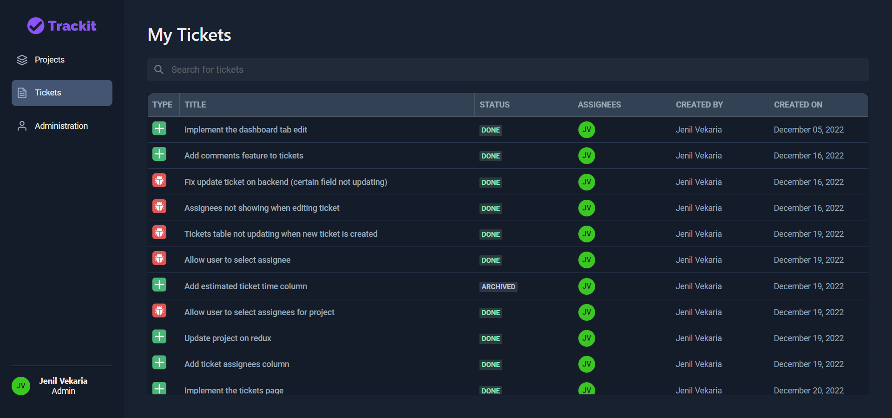

  <h3>Admin - Manage Users</h3>
  
Click on <b>Admin</b> to manage the organization (Users, Roles, Custom Ticket Type)

  
Click on <b>Manage User</b> to manage all the users and their roles. Clicking on the user will allow you to update their role

  <em><b>This tab will only be displayed if you are the admin</b></em>
  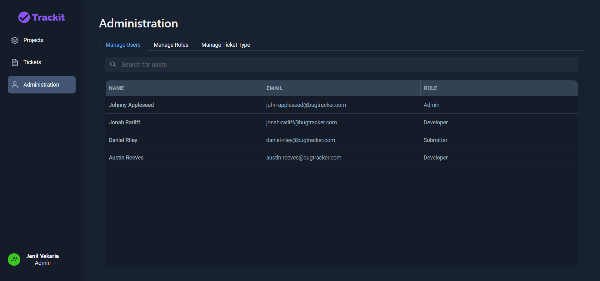

  <h3>Admin - Manage Roles</h3>
  
Manage Roles tab will display all the roles and their respective permissions. To create custom role, click on <b>Add New Role</b>

  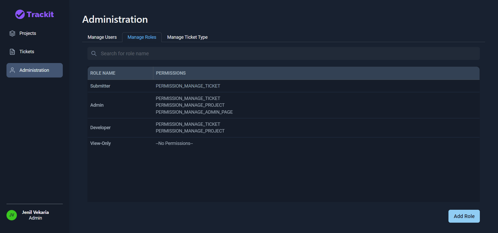

  <h3>Admin - Manage Roles (Add)</h3>
  
You can create your custom role by giving a role name and selecting the types of allowed actions

  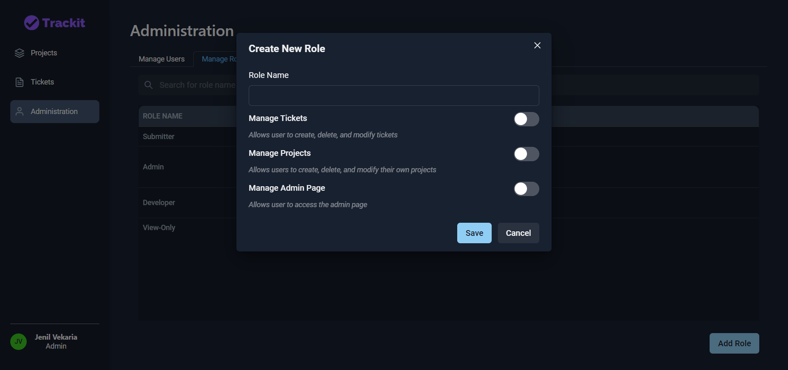

  <h3>Admin - Manage Ticket Types</h3>
  
You will see all the ticket types here. There are some pre-defined ticket types (Feature, Bug, Documentation, Support), but you may create custom ticket types by clicking on <b>Add New Ticket Type</b>

  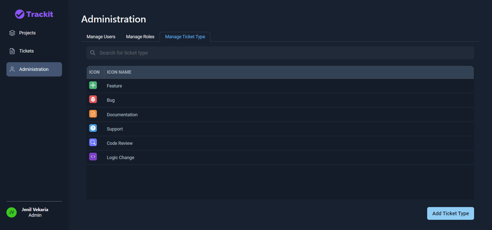

  <h3>Admin - Manage Ticket Types (Add)</h3>
  
Create custom ticket type by giving ticket type name, selecting an icon, and the icon colour

  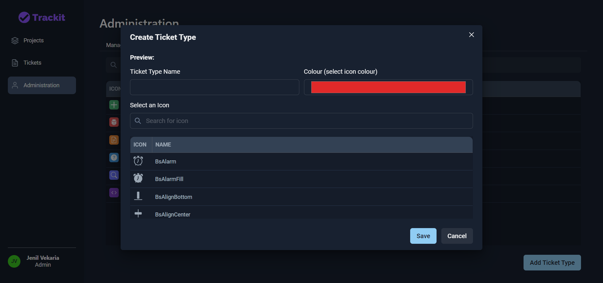

